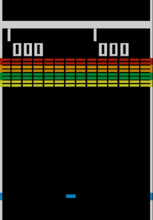

# Atividade 04 - Breakout

## Breakout - Arcade Game
> Breakout is an arcade video game developed and published by Atari, Inc. and released on May 13,1976. It was designed by Steve Wozniak, based on conceptualization from Nolan Bushnell and Steve Bristow who were influenced by the seminal 1972 Atari arcade game Pong

## Tela do jogo
- Tela de _Start_
  - Contagem de 3 segundos para o início do jogo
- Tela principal do game
  - Barra
  - Bola
  - 112 blocos (28 amarelos | verdes | laranjas | vermelhos)
  - HUD (pontuação e tentativas realizadas)
- Tela de pause
  - Pausa o _game loop_
  - Escreve "PAUSE"
## Personagem e sua movimentação
- Barra: esquerda-direita
- Bola: circular
## Controle e eventos
- Mover para esquerda ("Seta para esquerda")
- Mover para direita ("Seta para direita")
- _Pause_ ("Espaço")
- Movimentação pelo Mouse
### Mecânicas
1. Rebater na raquete
2. Rebater nas paredes (exceto a inferior)
3. Pontuar ao bater em um bloco:
  - Amarelos: 1 ponto
  - Verde: 3 pontos
  - Laranja: 5 pontos
  - Vermelho: 7 pontos
4. Quando a bola bater em um bloco, o bloco deverá desaparecer
5. Aumento da velocidade da bola conforme o jogador pontua:
  - Depois de 4 hits
  - Depois de 12 hits
  - Depois de bater em um bloco laranja ou vermelho
6. O jogador perde vida quando a bola bate na parede inferior:
  - Total de 4 vidas
7. A cada transição de tentativa na tela de carregamento a barra espande por alguns segundos, a bola bate algumas vezes na barra (não pontuando) até que o jogo comece novamente.